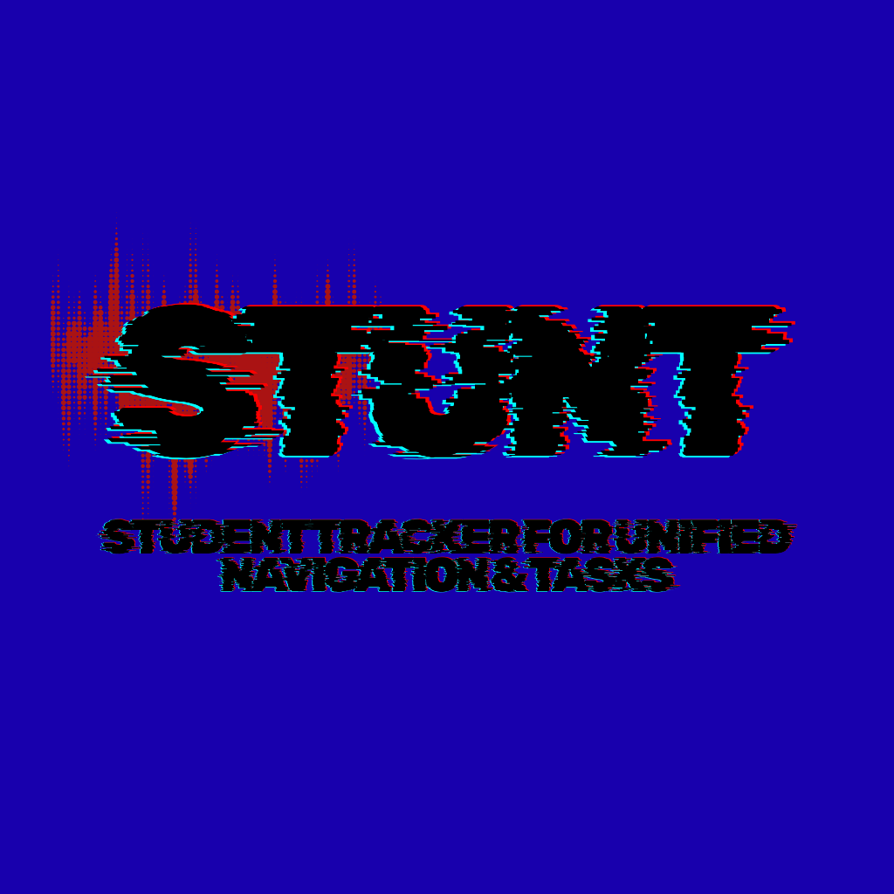

# STUNT — Student Tracker for Unified Navigation & Tasks 🚀

**STUNT** is a high-performance, 100% native Python desktop application designed for serious college students to track their 5-year degree journey, academic performance, attendance bunk safety, financial budgeting, targeted savings goals, and exam syllabus revision.



---

## 🌟 Key Features

* **⚡ 100% Native PyQt6 Architecture**: Pure Python GUI with executive dark aesthetics (`#0a0b10`), fluid navigation, and zero browser overhead.
* **🎬 Native Video Splash Screen**: Embedded video player (`RedandBlackGlitchcoreStuntLogo.mp4`) on application startup.
* **🏛️ University Minimum Attendance & Bunk Calculator**:
  * Set custom minimum attendance thresholds (75%, 80%, 85%).
  * Calculates exact bunk safety: 🟢 *SAFE: Can bunk 3 classes* OR 🔴 *CRITICAL: Attend next 5 lectures!*
* **🎓 CGPA / SGPA Intelligence & Target Predictor**:
  * Track credit hours and letter grades (`O=10`, `A+=9`, `A=8`, etc.).
  * Calculates SGPA per semester and overall cumulative CGPA.
  * Predicts the exact average SGPA required in remaining semesters to reach your target graduation CGPA.
  * Interactive Matplotlib SGPA trend line graph.
* **🎯 Targeted Savings Goals & Wishlist Tracker**:
  * Track items you want to purchase (Laptops, Smartphones, Trips, Certifications).
  * Direct deposit engine with progress bars and celebration popups upon reaching 100% savings.
* **📚 Exam Syllabus & Revision Matrix**:
  * Unit-by-unit subject breakdown with completion status and revision notes.
* **⏱️ Pomodoro Focus Study Timer**:
  * Integrated 25-minute focus session timer with 5-minute break chimes and completion alerts.
* **💰 Finance Ledger & Monthly Budget Alerts**:
  * Income and expense tracking with Matplotlib category donut charts and income vs. expense bar graphs.
  * Automated alerts when spending crosses monthly budget limits.
* **📄 1-Click Academic Transcript PDF Exporter**:
  * Export clean, printable HTML/PDF report cards summarizing your academic and financial records.
* **⏰ Live Lecture Alarms**:
  * Background system tray notifications 15 minutes before scheduled lectures.
* **🎨 Theme Accent Customizer**:
  * Switch between 4 built-in UI themes: *Glitchcore Dark*, *Midnight Cyberpunk*, *Emerald Tech*, and *Solar Amber*.

---

## 🛠️ Technology Stack

* **GUI Framework**: PyQt6 (Qt 6)
* **Database**: SQLite3 (Local Vault)
* **Data Visualization**: Matplotlib QtAgg (`FigureCanvasQTAgg`)
* **Multimedia**: PyQt6.QtMultimedia (QMediaPlayer, QVideoWidget)
* **Notifications**: PyQt6.QtWidgets (`QSystemTrayIcon`)
* **Executable Build**: PyInstaller

---

## 🚀 Quick Start & Installation

### Option 1: Run Pre-built Executable
Double-click `STUNT.exe` directly on your Desktop screen!

### Option 2: Run from Source
1. **Clone the Repository**:
   ```bash
   git clone https://github.com/bhatnagarakul5-debug/S.T.U.N.T-Student-Tracker-for-Unified-Navigation-Tasks.git
   cd S.T.U.N.T-Student-Tracker-for-Unified-Navigation-Tasks
   ```

2. **Install Dependencies**:
   ```bash
   pip install PyQt6 matplotlib pillow
   ```

3. **Launch Application**:
   ```bash
   python main.py
   ```

---

## 📜 License
Licensed under the [MIT License](LICENSE).
